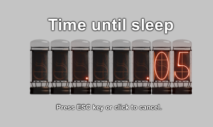

# windows-shutdown.exe v1.2

[English README](README.md)

一个小巧、简单的 Windows 工具，提供极简界面用于锁定、睡眠、重启或关机。支持轻量级配置文件（`config.txt`），可设置语言、自动操作、延迟和背景色。

<p align="center">
  
  
  
  
  
  
</p>

## 功能特性

- 极简界面，大号倒计时与操作标签。
- 支持操作：睡眠、关机、重启、锁定。
- 可选自动操作，延迟可配置。
- 可配置语言（中/英文）和背景色。
- 若缺少 `config.txt`，程序会自动在可执行文件旁生成（UTF-8 BOM）。
- 精美还原的命运石之门辉光管风格倒计时！（也可切换普通风格）

<p align="center">
  
</p>

## 交互模式

当 `config.txt` 缺失或 `action=none` 时：

双击可执行文件进入交互模式，程序会显示操作菜单，点击按钮即可执行对应操作。

## 定时关机（自动操作）⏱️

当 `config.txt` 包含有效的 `action`（如 `sleep`、`shutdown`、`restart`、`lock`），程序将自动模式运行。可通过 `delay`（秒）设置等待时间。

示例（60 秒后自动关机）：

```text
action=shutdown
delay=60
```

> 注意：`delay` 必须为非负整数（默认 5 秒）。

## 快捷方式自定义操作与图标 🖼️

如需为“睡眠”创建快捷方式，先创建指向 `windows-shutdown.exe` 的快捷方式，再编辑同目录下的 config 文件，设置 `action=sleep`（可自定义延迟）。保存后，使用该快捷方式即可直接执行睡眠操作。

所有操作图标均已内置于可执行文件。

## `config.txt` — 详细参考 🛠️

程序运行时会在可执行文件旁查找 `config.txt`，如缺失则自动生成带详细注释的默认文件（UTF-8 BOM）。

### 支持的配置项：

- `language` — 界面语言。可选：

  - `zh` — 中文（默认根据系统自动选择）
  - `en` — 英文

- `action` — 自动操作模式。可选：

  - `none` — （默认）显示菜单，等待用户选择
  - `sleep` — 延迟后睡眠
  - `shutdown` — 延迟后关机
  - `restart` — 延迟后重启
  - `lock` — 延迟后锁定

- `instruction` — 是否显示倒计时下方说明文字。可选：

  - `show` — 显示说明（默认）
  - `hide` — 隐藏说明

- `delay` — 自动操作前等待秒数，非负整数，默认 4

- `menuButtons` — 菜单按钮配置，英文逗号分隔。可选：

  - `Donate`, `Config`, `Lock`, `Sleep`, `Restart`, `Shutdown`
  - 示例：`menuButtons=Donate,Config,Lock,Sleep,Restart,Shutdown`（默认全部）

- `countdownStyle` — 倒计时风格。可选：

  - `normal` — 普通风格
  - `nixietube` — 命运石之门风格（默认）

- `backgroundColor` — 背景色。格式：
  - `#RRGGBBAA` — ARGB 十六进制（如 `#11223344`，最后两位为透明度）
  - `#RRGGBB` — RGB 十六进制（如 `#112233`，透明度默认半透明）

### 行为与警告：

- 无效或格式错误的配置项会被忽略并使用默认值，程序会收集警告并在界面显示。
- 若配置文件缺失，程序会自动生成带详细注释的 config 文件。
